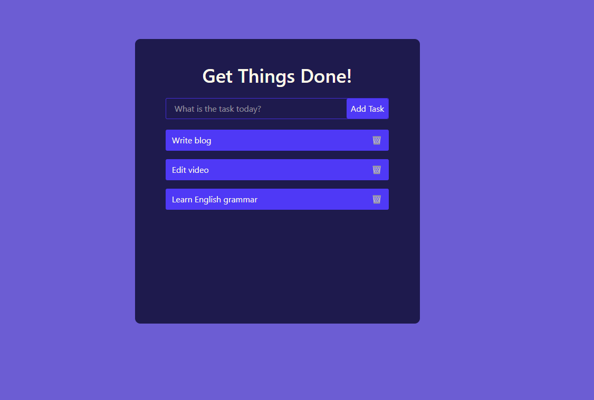

# 📝 Todo List App

  

## 📖 Overview
A simple **Todo List App** built with **React** and **Tailwind CSS**. This project focuses on practicing **React state management** and **Tailwind styling**.

## 🚀 Features
- Add tasks  
- Delete tasks  
- Responsive layout with Tailwind CSS  

## 🛠️ Tech Stack
- JavaScript  
- React  
- Tailwind CSS  
- Vite / Node.js  

## 📂 Project Structure
```
todo-app/
├─ public/
├─ src/
│  ├─ components/
│  │  ├─ AddButton.jsx
│  │  └─ TodoItem.jsx
│  ├─ App.jsx
│  └─ index.css
├─ package.json
├─ tailwind.config.js
└─ .gitignore
```

## 🎮 How to Run
1. Clone the repository:
```bash
git clone https://github.com/yourusername/todo-app.git
cd todo-app
```

2. Install dependencies:
```bash
npm install
```

3. Start the development server:
```bash
npm run dev
```

4. Open the app in your browser at `http://localhost:5173` (or the port Vite shows).  

## 🤝 Contributing
Contributions are welcome!  

1. Fork the repository  
2. Create a new branch:
```bash
git checkout -b feature-branch
```
3. Commit your changes:
```bash
git commit -m "Add new feature"
```
4. Push to the branch:
```bash
git push origin feature-branch
```
5. Open a Pull Request

## Screenshort

